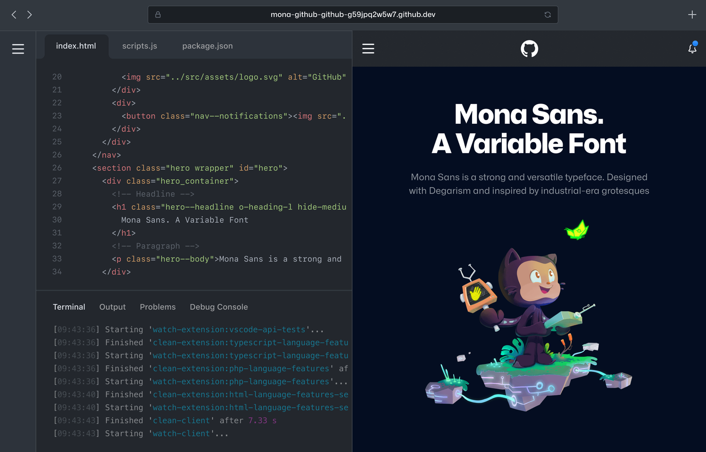
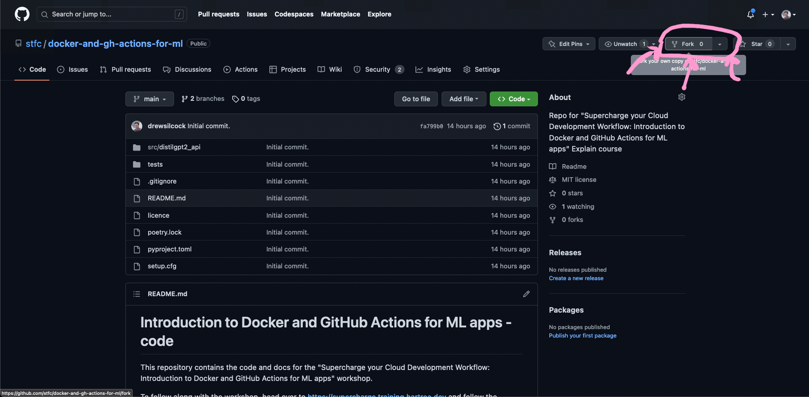
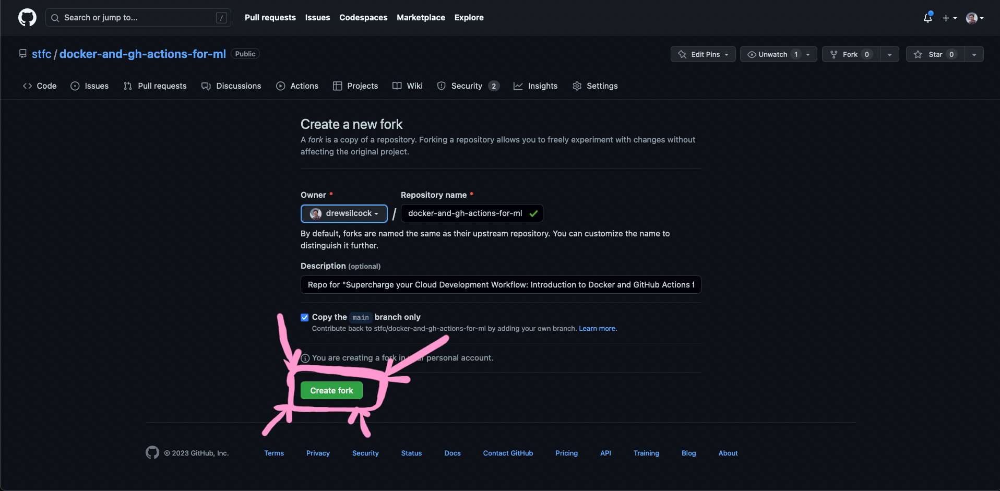
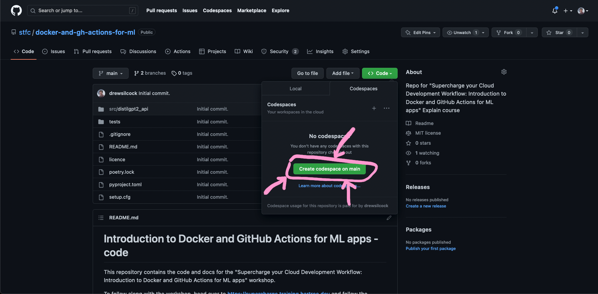

# 0. :desktop: Setup

Throughout this tutorial we will be using [GitHub Codespaces](https://github.com/features/codespaces){target="_blank" rel="noopener noreferrer"} to develop our code. This is basically VS Code in a browser - it's pretty cool!

**©️ GitHub, Inc.**
{: style="font-size: small; margin-top: -25px; width: 100%; text-align: center;"}

If you prefer to do this all on your local machine and you've got Docker all set up and installed, feel free - it doesn't make any difference to the course, it just means that you use your preferred code editor to make your changes and your own local terminal to run commands instead of GitHub Codespaces.

!!! note
    GitHub Codespaces has a generous free tier allowing you to have 60 free hours of Codespaces use on a 2-core codespace per month - you shouldn't get anywhere near this just from this course. In the unlikely event that you've already used up all of your free hours from prior use, you'll just have to run it locally instead.

## 🍴 Forking the repository

First things first, head over to https://github.com/stfc/docker-and-gh-actions-for-ml - this contains the code for our distilgpt2 model that we're going to use as the base for the cloud-native service we're going to implement.

Go ahead and click on "Fork" and then "Create fork" to create your own version of the repository within your own account - this is essential for some of the future steps we'll be working on.

**Forking the repository, step 1.**
{: style="font-size: small; margin-top: -25px; width: 100%; text-align: center;"}

**Forking the repository, step 2.**
{: style="font-size: small; margin-top: -25px; width: 100%; text-align: center;"}

!!! important
    We recommend you fork the repository as a public repository on your own account. This is because GitHub places limits on free use of certain resources like Actions and Packages on private repositories.

## 🧑‍💻 Setting up your codespace

Once you've forked the repository, you can create your codespace to get started editing the code. To do this, just click on the "Code" button to the left of the "About" section, click on the "Codespaces" tab and then click on "Create codespace on main" - this should automatically create your codespace and open it up in a new tab.

**Creating the GitHub Codespace.**
{: style="font-size: small; margin-top: -25px; width: 100%; text-align: center;"}

You might need to wait a couple of minutes for your codespace to initialise, but it shouldn't take too long. Once that's up and running, you're ready to get started! 🎊
