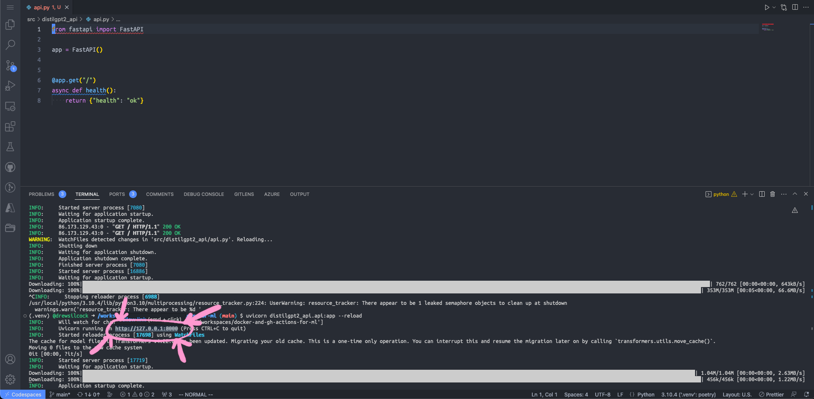

# 1. :robot: Creating our model API

First, we're going to wrap up our GPT-2 model in a nice RESTful API. Let's get stuck in.

## What's our model?

We're starting from an existing model here, so what exactly is it?

You can view the model card on Hugging Face here: https://huggingface.co/distilgpt2

In short, it's an NLP (Natural Language Processing) model that is a distilled (i.e. smaller) version of OpenAI's [GPT-2 model](https://openai.com/blog/gpt-2-1-5b-release/){target="_blank" rel="noopener noreferrer"}. We're using it as a fun and interactive model to use as a starting point for our exercises - it could be any model really, but this one is quite fun to play around with.

!!! info "What's the difference between GPT-2 and ChatGPT?"
    [ChatGPT](https://openai.com/blog/chatgpt/){target="_blank" rel="noopener noreferrer"} is part of the same research efforts by OpenAI, but it uses a fine-tuned version of the [GPT-3.5 model](https://platform.openai.com/docs/model-index-for-researchers){target="_blank" rel="noopener noreferrer"}, which means it is 2 steps ahead of our model. The [GPT-3](https://openai.com/blog/gpt-3-apps/){target="_blank" rel="noopener noreferrer"}, GPT-3.5 and ChatGPT models, unlike GPT-2, are closed source which means we can't download them and use them ourselves - we have to use OpenAI's own API to access them.

    The GPT-3 and GPT-3.5 models use colossally more parameters than GPT-2 which uses more than our distilled GPT-2 (GPT-3 has 175 billion parameters, GPT-2 has 1.5 billion and our distilled GPT-2 has 82 million), which is how they're able to give answers that are much more sophisticated. GPT-2 is still great for playing around with though - our model is only 350 MB while GPT-3 clocks in at an impressive 800 GB!

!!! question "Where is the model?"
    If you're looking at the code repository that we just forked, you might be thinking - "where is this ML model? I don't see it any more in the repo".

    Even though the model is small compared to the other GPT goliaths, it's still enough to pretty quickly use up your Git LFS storage allocation on GitHub. To work around this, we download the model from the Hugging Face library within the code itself.

## FastAPI

<div style="float: right; width: 50%">
    
    <p style="font-weight: bold; margin-top: -10px; font-size: small; width: 100%; text-align: center">©️ Sebastián Ramírez</p>
</div>

Most (but not all) ML models use Python, so that's what we're going to use.

There are a bunch of different frameworks and libraries for creating APIs in Python - you might have used / heard of [Flask](https://flask.palletsprojects.com/en/2.2.x/){target="_blank" rel="noopener noreferrer"} and [Django](https://www.djangoproject.com/){target="_blank" rel="noopener noreferrer"} as the main ones. We are instead using a much newer and more modern framework called [FastAPI](https://fastapi.tiangolo.com/){target="_blank" rel="noopener noreferrer"}.

You should already be familiar with this from the introductory talk - to summarise, here are the main selling points of FastAPI:

- As the name suggests, it's super simple and quick to get set up and running - there's minimal boilerplate code and the documentation is excellent.
- It is based on modern language features like type hints, meaning excellent editor support (i.e. completion everywhere) and less code to write.
- It automatically creates and serves [interactive documentation](https://github.com/Redocly/redoc){target="_blank" rel="noopener noreferrer"} and an [API specification](https://github.com/OAI/OpenAPI-Specification){target="_blank" rel="noopener noreferrer"} for you.

We're really only scratching the surface of what you can do with FastAPI here.

## What's in our repo?

Let's have a quick look at the files we've got in our repository. Have an explore with the Codespaces editor. The important files are:

- `pyproject.toml` - This file specifies all of our dependencies and package details, including the version of Python, FastAPI and pytorch that we're using.
- `src/distilgpt2_api/` - This folders contains all of our actual Python code, and it's where we're going to be adding our extra FastAPI code.
- `src/distilgpt2_api/text_generation.py` - This contains a wrapper around the Hugging Face transformers library to load and invoke the DistilGPT2 model via the very simple `TextGenerator` class.

## Let's create our FastAPI app

By convention, the code containing all the FastAPI endpoints is put in a file called `api.py`, so let's create that! The full path should be `src/distilgpt2_api/api.py`.

First, we create our FastAPI app instance and create an endpoint on the root of our API. We'll use this endpoint as a simple "health" check - commonly used for orchestration and cloud platforms to verify that your service is running as expected:

!!! example "`src/distilgpt2_api/api.py`"
    ```python linenums="1"
    from fastapi import FastAPI

    app = FastAPI()


    @app.get("/")
    async def health():
        return {"health": "ok"}
    ```

Just with this, we've got a working API alongside automatically generated OpenAPI specification and documentation!

!!! tip "What's that `async` doing there?"
    You might notice that our endpoint has `async` at the front. You may or may not be familiar with the asynchronous programming in general or in Python and the async-await syntax introduced in [Python 3.7](https://docs.python.org/3.7/whatsnew/3.7.html){target="_blank" rel="noopener noreferrer"}.

    All FastAPI endpoints are asynchronous, meaning that you can do await asynchronous functions inside the endpoint - this allows for significant efficiencies when doing things that are dependent on I/O or network calls. For instance, your endpoint can await a call to another network service or a await a call to read a large file. While the app is waiting for the network call / I/O to finish, it is free to do other things like handle other requests. The thread will be woken back up again once the async I/O or network call has finished and the endpoint will resume from where it left off.

To run this, open the terminal in Codespaces.


Next, create our virtual environment and install the dependencies:

```bash
python -m venv .venv
source ./.venv/bin/activate
poetry install
```

This may take a couple of minutes, as it has to download all the dependencies, including pytorch which is quite big.

<div style="float: left; width: 30%">
    
    <p style="font-weight: bold; margin-top: -10px; font-size: small; width: 100%; text-align: center">©️ Encode OSS Ltd</p>
</div>

Once that's done, we can run our API:

```bash
uvicorn distilgpt2_api.api:app --reload
```

This will use the [Uvicorn](https://www.uvicorn.org/){target="_blank" rel="noopener noreferrer"} ASGI server to run our FastAPI application on port 8000 and will automatically reload whenever we make any changes to the code. This means we can keep that running in the background and not worry about having to restart or recompile any code. Pretty neat! ✨

!!! info "What's this 'ASGI' all about then?"
    Traditionally, web servers serving up Python applications would use the Web Server Gateway Interface (WSGI, pronounced phonetically). This is a standard allowing web servers to call Python code synchronously.

    The modern, asynchronous variant of this is Asynchronous Server Gateway Interface (ASGI, pronounced however you like). To cut a long story short, ASGI is a modern successor to WSGI that adds async support.

Codespaces will automatically forward this locally running port so that we can access it from our browser. To do that, click on "Ports" next to "Terminal" in Codespaces and go over to the row in the table that says "8000" under "Port". Mouse over the "Local address" and click on the little globe - this will open up that forwarded port in a new browser window. If all goes well, you should see your happy little health endpoint! 🥳


**Step 1: Click on the "Ports" button to the right of "Terminal"**
{: style="font-size: small; margin-top: -25px; width: 100%; text-align: center;"}


**Step 2: Click on the "Open in Browser" button for the row corresponding to port 8000**
{: style="font-size: small; margin-top: -25px; width: 100%; text-align: center;"}


**Step 3: Bask in the glory of your success**
{: style="font-size: small; margin-top: -25px; width: 100%; text-align: center;"}

!!! important "Caveat on port forwarding"
    If you quit your server and re-run it, Codespaces will close the forwarded port and create a new one when you restart the server.

    This means that if you kill the `uvicorn` command with Ctrl+C and re-run it, you'll need to go through this process to open up the port again.

As a shortcut, you can also Cmd+Click or Ctrl+Click on the URL `http://127.0.0.1:8000` in the terminal output - Codespaces will intercept this click and open up the port-forwarded address - pretty clever!



**As a shortcut, you can also Cmd+Click / Ctrl+Click on the local port in the terminal output**
{: style="font-size: small; margin-top: -25px; width: 100%; text-align: center;"}

!!! tip "Check out the auto-generated docs"
    Now that we've got our server up and running, we can check out the automatic documentation that FastAPI has generated.

    First, head over to the URL for the forwarded port to see the base health endpoint. Next, add `/docs` to the URL. This will take you to the SwaggerUI page, which is a visual demonstrate of the generated OpenAPI specification. This OpenAPI spec can be used to generate clients for the API in any language you desire.

    Second, replace `/docs` with `/redoc`. This will show you the generated documentation site for the API (using the Redoc library).

    Both of these are fairly empty at the moment - we do only have one endpoint at the moment after all. Once you've built up a bigger API and you've got all sorts of interesting data types and parameters, these auto-generated docs will be invaluable.

## Now let's implement our text generation endpoint

Our API is going to be really simple - we only need to do one thing, and that is generate text based on a user's input. It's going to take in the user's prompt, along with a couple of optional parameters like the number of sequences to generate, and it's going to return an array containing the generated texts.

So let's create a new endpoint for this. We're going to make it a GET endpoint because it makes it easier to test with the browser, but in a production environment you may want to make it a POST endpoint because:

- You may want to include large initial prompts, which the POST body is better suited for (GET requests cannot contain a body).
- GET requests can be cached by intermediate servers but you may not want that as the model will generate different text each time you run it.

On a more abstract semantic level, you can this of this endpoint as either *getting* the generated text from a prompt or *creating* a new completion from the input text (even if that completion isn't stored anywhere on the server). Personally, we think the latter is more semantically appropriate, but let's forget about that for the moment and just go with GET so that we can more easily test our API with our browser.

Here's what our new endpoint should look like:

!!! example "`src/distilgpt2_api/api.py`"
    ```python linenums linenums="1" hl_lines="3 13-23"
    from fastapi import FastAPI

    from .text_generation import TextGenerator

    app = FastAPI()


    @app.get("/")
    async def health():
        return {"health": "ok"}


    @app.get("/{prompt}")
    async def generate_text(
        prompt: str,
        max_new_tokens: int = 50,
        num_return_sequences: int = 1,
    ) -> dict:
        model = TextGenerator()
        sequences = model.generate(
            prompt, max_new_tokens=max_new_tokens, num_return_sequences=num_return_sequences
        )
        return {"generated_sequences": sequences}
    ```

This creates an endpoint so that whenever we query `/any text here` on our API, we pass the string `any text here` through to the model and return all of the generated sequences in a dictionary. Simple, right?

Importantly, we don't need to specify that `prompt` is passed through in the path of the API call while `max_new_tokens` and `num_return_sequences` are passed through as query parameters - FastAPI can see that we have a variable in our path called `{prompt}` so it knows that the `prompt` value gets passed through in the path. The other two are inferred to be query parameters because there aren't corresponding variables in the path.

Also, we don't need to do any validation or conversion of the input parameters to the function - FastAPI handles all of that for us because it knows that `prompt` is a str while `max_new_tokens` is an integer - it's in the type hints!

!!! tip "More advanced parameter specification"
    FastAPI supports much more advanced endpoint parameter specification, such as:

    - Requiring that a string parameter be a particular enum.
    - Requiring that a string parameter be a certain length, e.g. between 15 and 20 characters.
    - Requiring that a string parameter conform to a particular regex.
    - Requiring that an integer be more or less than a particular value
    - Lots more!

    What's more, where possible all of these validations and metadata are passed through to the OpenAPI specification so that any clients are aware of the restrictions as well.

Now, this endpoint is fully working, but there's a problem.

We're re-creating the `TextGenerator` instance every time anyone makes a request to the API, but if we look at the `src/distilgpt2_api/text_generation.py` file, we can see that this is loading the whole DistilGPT2 model in fresh each time. Now, pytorch does cache the model locally so that it doesn't have to download 350 MB each time, but it still takes a while to load the model into memory. We can fix this!

We're going to create a new function, aptly called `get_model`. This model is going to going to be very simple - all it does is instantiate the `TextGenerator` class. The important thing is that we're going to decorate it with the [`functools.cache` decorator](https://docs.python.org/3/library/functools.html#functools.cache){target="_blank" rel="noopener noreferrer"} - this caches the result of the function invocation so that when we run `get_model()` again, we don't actually re-instantiate the `TextGenerator` class - we return the already created instance. Here's what that looks like:

!!! example "`src/distilgpt2_api/api.py`"
    ```python linenums="1" hl_lines="2 11-14 28"
    import logging
    from functools import cache

    from fastapi import FastAPI

    from .text_generation import TextGenerator

    app = FastAPI()


    @cache
    def get_model() -> TextGenerator:
        logging.info("Loading DistilGPT2 model")
        return TextGenerator()


    @app.get("/")
    async def health():
        return {"health": "ok"}


    @app.get("/{prompt}")
    async def generate_text(
        prompt: str,
        max_new_tokens: int = 50,
        num_return_sequences: int = 1,
    ) -> dict:
        model = get_model()
        sequences = model.generate(
            prompt, max_new_tokens=max_new_tokens, num_return_sequences=num_return_sequences
        )
        return {"generated_sequences": sequences}
    ```

As simple as that, we've reduce the time it takes to run a single text generation massively!

In fact, we can improve it even further. For every subsequent request to the API, we're going to use the existing loaded model. That's great, but that first request will still take much longer because it has to load the model in fresh. This is confusing for an end-user where the request sometimes takes ages and sometimes is really quick. We can fix this too!

All we need to do is take advantage of some of FastAPI's built-in application lifecycle events, namely the "startup" event. Here's what that looks like:

!!! example "`src/distilgpt2_api/api.py`"
    ```python linenums="1" hl_lines="17-19"
    import logging
    from functools import cache

    from fastapi import FastAPI

    from .text_generation import TextGenerator

    app = FastAPI()


    @cache
    def get_model() -> TextGenerator:
        logging.info("Loading DistilGPT2 model")
        return TextGenerator()


    @app.on_event("startup")
    async def on_startup():
        get_model()


    @app.get("/")
    async def health():
        return {"health": "ok"}


    @app.get("/{prompt}")
    async def generate_text(
        prompt: str,
        max_new_tokens: int = 50,
        num_return_sequences: int = 1,
    ) -> dict:
        model = get_model()
        sequences = model.generate(
            prompt, max_new_tokens=max_new_tokens, num_return_sequences=num_return_sequences
        )
        return {"generated_sequences": sequences}
    ```

With that added, we automatically load the model whenever our API starts up, making sure every request is reliably speedy!

## Try it out

To make sure this is working correctly, give it a go!

Take your browser of choice and open up the port forwarded address - try adding `/Once upon a time` or `/The answer is life is` or whatever you want. See what kind of text is being generated with your user input.

Next, try out these query parameters that we specified above, e.g. `/Once upon a time?max_new_tokens=100&num_return_sequences=5`.

!!! success "Good job!"
    Just like that, we've wrapped up our ML model in a lovely little REST API using FastAPI.

    Now we're ready to move on to containerising it.
