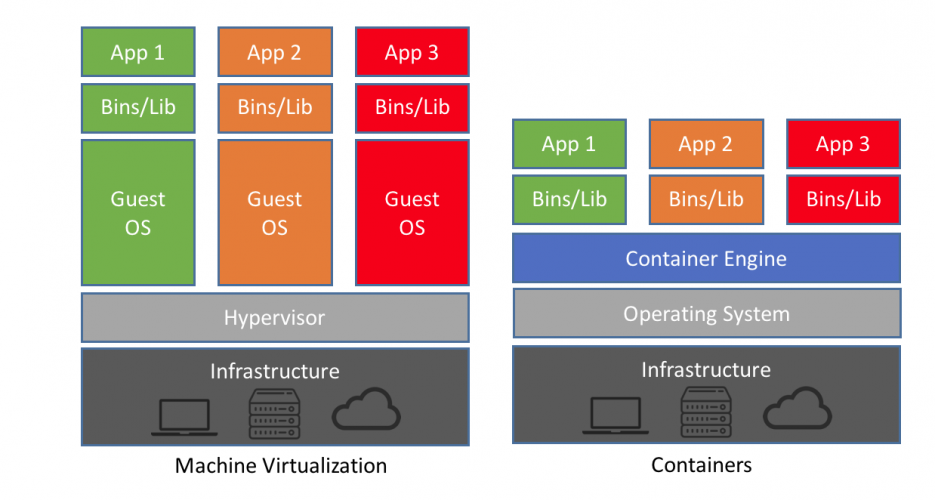

# 2. :package: Containerising it

Now that we've implemented our FastAPI REST API around the ML model, we're ready to wrap this up in a nice, self-contained Docker dependency.

Docker is especially useful for programming languages with a runtime, like Python, where you need to install the Python interpreter wherever you want to run your code - pretty quickly you run into version conflicts and all that nonsense.

Once we've bundled up our API in a Docker container, we can take it anywhere and run it easily without worrying about installing dependencies or different libc implementations or Python versions or any of that nonsense.

## Recap - what are containers?

!!! info
    This explainer quickly goes over what containers are - if you're happy with what containers are and how they work, feel free to skip ahead to ["Let's get containerised!"](#lets-get-containerised).

Before we start coding away, let's first explain what containers are and how they work.

### Terminology

First of all, let's reiterate a bit of terminology:

**Container image** - a built self-contained bundle holding all the files, code & dependencies to run whatever it is you're working on.

**Container** - a running instance of a container image. You can run as many container instances as you want from a single image, and once the container is running you can access a shell in that container and run whatever commands you want like any other command line[^1]. This can be super useful for debugging any problems!

[^1]: This assumes that the image you're working with has a shell installed - if you have an image using the [scratch](https://hub.docker.com/_/scratch){target="_blank" rel="noopener noreferrer"} image, you won't have *anything* like this. It's precisely for this reason that using this image isn't recommended unless you specifically need *very very* small Docker images.

**Container engine** - The software that handles all the container-related tasks like building images, running containers, killing containers, etc.

**Container registry** - This is a server that acts as a library for storing and retrieving images. There are public ones like [Docker Hub](https://hub.docker.com/){target="_blank" rel="noopener noreferrer"} and [Singularity Hub](https://singularityhub.com/){target="_blank" rel="noopener noreferrer"}. We're using GitHub's container registry, also called [GitHub Container Registry](https://docs.github.com/en/packages/working-with-a-github-packages-registry/working-with-the-container-registry){target="_blank" rel="noopener noreferrer"} or GHCR for short.

**Tag** - This is a label that you apply to an image. This is usually a version but it can be anything you want! There's one special tag, though: `latest`. This is the default tag that's used if you don't specify a tag and should point to the latest, greatest version of your image. If you're looking for most up-to-date version of any other application's image, you can always look for that `latest` tag.

**Base image** - Container images work in layers so that images can be re-used as the basis for another image. This is called the "base" of your image. What this is really telling Docker (or other engine) is that your image is really just this base image, with a few bits added. Your output image will contain all the layers for your base image, but with an extra layer (or more) for the changes you've added on top. This layer re-use makes downloading derivative images much quicker and more efficient.

### How does it work?

Containers are fundamentally a Linux technology! [^2]

[^2]: In fact, if you're running Docker on either macOS or Windows, you'll be running a Linux virtual machine under the hood - all of the container cleverness happens inside the virtual machine's Linux kernel.

In fact, containers are really a collection of features of the Linux kernel that enable you to namespace things like filesystems, processes, networks and memory. What this means is that a container can have its own processes that run *completely isolated* from the rest of your system, and this separation is enforced at the kernel level.

There's no way that another container or process outside of the container runtime can access anything inside your image because the kernel enforces the isolation. This is a really simple concept (the specifics of the implementation are not so simple) but the power and versatility that you can get out of this simple idea are pretty extraordinary!

As all the running containers on your machine share the same kernel, there's much less runtime overhead for containers vs. virtual machines and the container images themselves can be just a few kilobytes instead of gigabytes. (As a rule of thumb, there's not generally any significant CPU overhead for running inside a container, but there is some overhead associated with the network stack. You can read some numbers for container performance characterisation [here](https://www.nginx.com/blog/comparing-nginx-performance-bare-metal-and-virtual-environments/){target="_blank" rel="noopener noreferrer"}.)



**From:** https://blog.netapp.com/blogs/containers-vs-vms/
{: style="font-size: small; margin-top: -30px; width: 100%; text-align: center;"}

If you want to get a deeper understanding of how containers work under the hood, I'd highly recommend the [blog posts](https://jvns.ca/categories/containers/){target="_blank" rel="noopener noreferrer"} and [zines](https://wizardzines.com/zines/containers/){target="_blank" rel="noopener noreferrer"} by [Julia Evans](https://twitter.com/b0rk){target="_blank" rel="noopener noreferrer"}.

### Container technologies

As far as container tooling goes, there's a whale that dominates the market, but there are a few others that are slowly gaining ground.

#### Docker

{: style="height: 100px; float: right;"}

This is the main player in the container world, by far - the metaphorical whale. (It's also the one with the whale logo.) Docker was the company that popularised containerisation, which means the formats created by Docker had a massive impact on the container landscape.

While Docker Inc. is a private company, all of the code behind it is [Open Source](https://github.com/docker/){target="_blank" rel="noopener noreferrer"}. They also spun out their [core container runtime](https://containerd.io/){target="_blank" rel="noopener noreferrer"} functionality into a separate component and donated it to the care of the [Cloud Native Computing Foundation (ONCF)](https://www.cncf.io/){target="_blank" rel="noopener noreferrer"}, a part of the non-profit [Linux Foundation](https://www.linuxfoundation.org/){target="_blank" rel="noopener noreferrer"}.

In June 2015, Docker and other container companies established the [Open Container Initiative](https://www.opencontainers.org/){target="_blank" rel="noopener noreferrer"} - this organisation is also a Linux Foundation project and designs the specifications for the container runtime - [runtime-spec](https://github.com/opencontainers/runtime-spec){target="_blank" rel="noopener noreferrer"} and image format - [image-spec](https://github.com/opencontainers/image-spec){target="_blank" rel="noopener noreferrer"}.

While Docker is still the main tool, as most of the underlying technologies ([containerd](https://github.com/containerd/containerd){target="_blank" rel="noopener noreferrer"}, [runc](https://github.com/opencontainers/runc){target="_blank" rel="noopener noreferrer"}) and specifications ([OCI Image Spec](https://github.com/opencontainers/image-spec){target="_blank" rel="noopener noreferrer"}, [OCI Runtime Spec](https://github.com/opencontainers/runtime-spec){target="_blank" rel="noopener noreferrer"}) are open source, there are plenty of alternative tools that you can use.

#### Podman

{: style="height: 100px; float: right;"}

Even though it dominates the market, Docker isn't the only container runtime around with a logo of a happy cute sea animal!

Enter [Podman](https://podman.io/){target="_blank" rel="noopener noreferrer"}.

The main differentiator between Docker and Podman is that Podman doesn't need a daemon running in the background (usually as root)[^3]. This makes it popular for security-conscious users or where root access to the underlying machine is not available (e.g. in HPC environments) or where you don't have root permissions on the machine.

[^3]:
    The Docker daemon *can* now run in [rootless mode](https://docs.docker.com/engine/security/rootless/){target="_blank" rel="noopener noreferrer"}. As of Docker Engine v20.10 this is no longer considered experimental, but even rootless Docker still runs with a daemon - it just runs the daemon inside a user namespace.

#### Apptainer / Singularity

<div style="float: right; width: 50%">
    
    <p style="font-weight: bold; margin-top: -10px; font-size: small; width: 100%; text-align: center">©️ Linux Foundation</p>
</div>

Apptainer is similar to Podman in arising out of a need for a rootless container runtime. Apptainer also maintains full support for Docker images (they really are the de-facto standard).

The main difference is that Apptainer is aimed at the scientific computing market - it's specifically designed to work with and marketed towards HPC systems and allow for easily running containerised HPC workloads without any significant overhead and without needing any special privileges.

<div style="float: left; width: 35%; margin-right: 8px">
    
    <p style="font-weight: bold; margin-top: -10px; font-size: small; width: 100%; text-align: center">©️ Sylabs™ Inc.</p>
</div>

Confusing, what was once called "Singularity" changed its name to "Apptainer" in 2021 when it was adopted by the Linux Foundation. "Singularity" is still a product but now refers to a fork from company Syslabs, who have products "Singularity CE", "SingularityPRO" and "Singularity Enterprise Edition". Basically, when people talk about "Singularity", they probably mean Apptainer. It was a whole thing.

## Let's get containerised!

The first step to containerising any application is to create a filled called `Dockerfile`. This is like a `Makefile` but for Docker and it tells Docker what steps it needs to run to create the full environment that your application is going to run in.

We're going to start off by specifying a base image - this comes with Python built-in, which means we don't have to worry about installing the right version of Python.

!!! example "`Dockerfile`"
    ```dockerfile linenums="1"
    FROM python:3.10-slim

    COPY . .

    EXPOSE 8000

    CMD [ \
        "gunicorn", \
        "distilgpt2_api.api:app", \
        "--worker-class", "uvicorn.workers.UvicornWorker", \
        "--workers", "1", \
        "--bind", "0.0.0.0:8000" \
    ]
    ```

This is pretty much as simple you can can get. It starts off with the official Python 3.10 image (the slim version, meaning it's slightly smaller than the default image).

Next, it copies all of our code from our repository into the image.

The `EXPOSE` command doesn't do anything functional - it's purely documenting that the application listens on port 8000. We'll need that later because that's exactly how Azure App Service determines which port it should forward when it runs our Docker image in the cloud.

Then, it specifies what command should be run when a container using this image is run.

!!! note "Choosing a Python base image"
    There are loads of different base images you could use for Python, from "slim" to "bullseye" to "alpine" and plenty more if you're looking outside the official python images.

    In general there's no right choice about which image you should use, other than to avoid the temptation to use "alpine" even though it's much smaller than the Debian-based images. The [PythonSpeed articles](https://pythonspeed.com/articles/base-image-python-docker-images/) on the topic go into loads of detail about the trade-offs of the various options.

We're using Gunicorn here on top of Uvicorn here - Gunicorn provides an extra layer of production-ready application serving to handle things like multiple worker, address binding, etc. In this case we're only using one worker to reduce memory usage, but it's considered best practice to use Gunicorn + Uvicorn when deploying a FastAPI application.

Now, we can build this image and run it right now if we want to, but we're not going to get very far. That's because we haven't installed our dependencies yet! We don't have Gunicorn or Uvicorn or even FastAPI installed.

Next, we're going to update our `Dockerfile` to install Poetry, the tool we're using for managing our Python dependencies.

!!! example "`Dockerfile`"
    ```dockerfile linenums="1" hl_lines="3-13"
    FROM python:3.10-slim

    ENV \
        POETRY_VERSION="1.3.2" \
        POETRY_VIRTUALENVS_IN_PROJECT=true \
        POETRY_NO_INTERACTION=1 \
        VENV_PATH="/app/.venv"

    ENV PATH="$VENV_PATH/bin:/root/.local/bin:$PATH"
    RUN mkdir -p "$VENV_PATH"
    WORKDIR "/app"

    RUN pip install pipx && pipx install poetry==$POETRY_VERSION

    COPY . .

    EXPOSE 8000

    CMD [ \
        "gunicorn", \
        "distilgpt2_api.api:app", \
        "--worker-class", "uvicorn.workers.UvicornWorker", \
        "--workers", "1", \
        "--bind", "0.0.0.0:8000" \
    ]
    ```

There's quite a lot going on here, but the important bit is really line 21. That's the bit that installs Poetry. The rest is pretty much just there to make sure the environment is all set up correctly with the version of Poetry, folder to install Poetry into, curl is installed to retrieve the Poetry installation script, etc.

Now that we've got Poetry installed, we're ready to install all of our application dependencies:

!!! example "`Dockerfile`"
    ```dockerfile linenums="1" hl_lines="16"
    FROM python:3.10-slim

    ENV \
        POETRY_VERSION="1.3.2" \
        POETRY_VIRTUALENVS_IN_PROJECT=true \
        POETRY_NO_INTERACTION=1 \
        VENV_PATH="/app/.venv"

    ENV PATH="$VENV_PATH/bin:/root/.local/bin:$PATH"
    RUN mkdir -p "$VENV_PATH"
    WORKDIR "/app"

    RUN pip install pipx && pipx install poetry==$POETRY_VERSION

    COPY . .
    RUN poetry install --no-dev

    EXPOSE 8000

    CMD [ \
        "gunicorn", \
        "distilgpt2_api.api:app", \
        "--worker-class", "uvicorn.workers.UvicornWorker", \
        "--workers", "1", \
        "--bind", "0.0.0.0:8000" \
    ]
    ```

Great! Now we've got a working basic `Dockerfile`, let's try building and running it:

```bash
docker build -t docker-and-github-actions-for-ml .
```

This builds the Docker image for the current folder (`Dockerfile` is the default file to look for, but you can change this if you need to) and gives it the tag `docker-and-github-actions-for-ml` so that we can run it later.

!!! warning "Heads up for those running on Apple Silicon chips"
    If you're doing this workshop using your own laptop which happens to be a Mac using an ARM64 chip (a.k.a. Apple Silicon) and you are using Docker Desktop, you'll run into some problems because Docker will try to build for linux/arm64, which pytorch don't provide a wheel for.

    In short, you'll have to replace `docker build` with `docker buildx build --platform linux/amd64`.

    If you're using Codespaces or are running on Windows / Linux systems, you don't need to worry about this.

Once that has successfully completed, we can run our Docker image as a container. Kill your previous `uvicorn` command if it's still running and try this one:

```bash
docker run --rm -p 8000:8000 docker-and-github-actions-for-ml
```

This runs the image with the tag `docker-and-github-actions-for-ml`. The `--rm` means that the container is removed after it has finished running, instead of leaving it lingering around to pointlessly use up space. The `-p 8000:8000` forwards the port from inside the Docker container and the running host. This is necessary to be able to access the API from outside of the running container.

Follow the procedure outlined in the last section to open up the URL that GitHub Codespaces creates for the port forwarding and make sure you can hit the same endpoints that you could when we were running outside of the container using the simple `uvicorn` command.

## Optimising the build cache

Our Docker image already works, but we can improve it a bit.

First things first, we can add a file called `.dockerignore` to our repository - this will allow us to exclude lots of files from being added to our image that we don't want. Let's start off with the contents of our `.gitignore` and then add a few more:

```bash
cp .gitignore .dockerignore
```

There's a few extra things you can ignore from Docker that you can't from git - let's add these to the beginning of the `.dockerignore`:

!!! example "`.dockerignore`"
    ```bash linenums="1"
    .dockerignore
    .gitignore
    Dockerfile
    licence
    .git

    # The rest is the contents of the .gitignore file.
    ...
    ```

Next, let's update our Dockerfile so that we add and install all of our dependencies before adding our actual application code. What this means is that if we are only updating our application code but not updating any dependencies, when we re-build our Docker image, we don't need to re-install the dependencies in the build process - Docker will use the build cache that it maintains to speed up the build process massively.

!!! example "`Dockerfile`"
    ```dockerfile linenums="1" hl_lines="15-20"
    FROM python:3.10-slim

    ENV \
        POETRY_VERSION="1.3.2" \
        POETRY_VIRTUALENVS_IN_PROJECT=true \
        POETRY_NO_INTERACTION=1 \
        VENV_PATH="/app/.venv"

    ENV PATH="$VENV_PATH/bin:/root/.local/bin:$PATH"
    RUN mkdir -p "$VENV_PATH"
    WORKDIR "/app"

    RUN pip install pipx && pipx install poetry==$POETRY_VERSION

    COPY ./pyproject.toml ./poetry.lock ./
    RUN poetry install --no-dev --no-root

    COPY README.md ./
    COPY src ./src
    RUN poetry install --no-dev

    EXPOSE 8000

    CMD [ \
        "gunicorn", \
        "distilgpt2_api.api:app", \
        "--worker-class", "uvicorn.workers.UvicornWorker", \
        "--workers", "1", \
        "--bind", "0.0.0.0:8000" \
    ]
    ```

Let's quickly re-build our image - you should see `CACHED` appear in the output of the `docker build` command for most of these lines, indicating that Docker is using the build cache to skip re-running the command:

```bash
docker build -t docker-and-github-actions-for-ml .
```

!!! info "Production-ready Dockerfile"
    This Dockerfile is still fairly basic. When you're containerising applications in a production-ready setting, you will want to put a bit more time into doing some of the "best practices" for Dockerfiles that we don't have time to fully explore today, such as:

    - Restricting the image so that the container runs as an unprivileged user instead of the default root user.
    - Splitting the Dockerfile into separate builder and app stages, so that we can install all our dependencies in the builder and then copy the built files into our app stage. This means that our final app image doesn't need to have things like curl or Poetry installed - it just has the installed dependencies and the application code. This can significantly reduce image sizes.

!!! success "Well containerised!"
    You have now successfully containerised your application!

    Now that we've got a working container image, we can deploy it as a cloud-native service to Azure.
