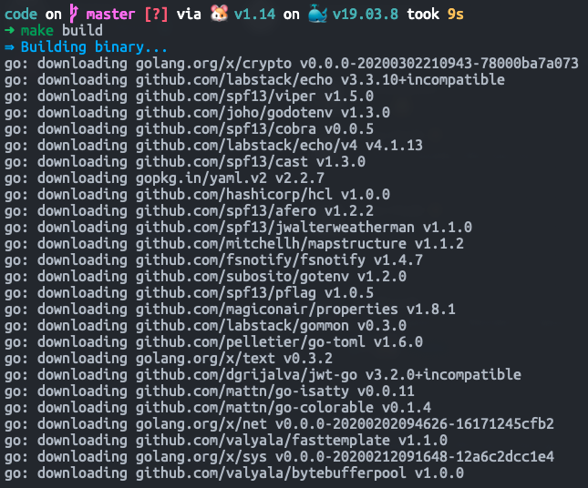
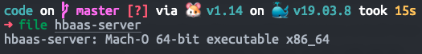
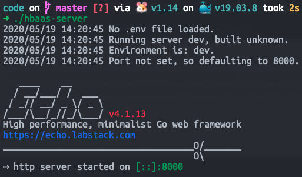

# 2. :sparkles: My first feature branch

Now that we've got our repo forked and cloned with our git flow skeleton in place, we can see the flow in action by completing our first feature!

## Compiling our server

Before we add our first, let's first get our server compiled and running so that we can make sure that we've got our system set up with all the dependencies.

If you look in the repo, you'll see a `Makefile` in there. Don't worry about the generic stuff in there - the important bit is the targets:

```makefile
## build: Build the server
build:
    @$(call log,Building binary...)
    @GOPATH=$(GOPATH) GOBIN=$(GOBIN) go build -o $(OUTBINDIR)/$(PROJECTNAME) $(GOFILES) || (\
        $(call log-error,Failed to build $(PROJECTNAME).) \
        && false \
    )

## clean: Clean build files.
clean:
    @-rm $(OUTBINDIR)/$(PROJECTNAME) 2> /dev/null
    @GOPATH=$(GOPATH) GOBIN=$(GOBIN) go clean
```

This tells that that in order to build our server, we need to run:

```sh
make build
```

So let's give it a go!

You should see something like this:



If you've got this far, you've successfully built your Go web service!

One of the best things about Go is that everything happens at built time - the output of this build is a single file, which contains everything we need for our web server:



As our application gets more complication and includes more and more functionality, everything will still always be bundled up in this single executable. This might not seen like a big deal now, but when we get onto the containerisation later, you'll see how much easier this makes our lives!

## Running the server

You might be wondering at this point what exactly this `hbaas-server` is - let's find out!

We can run our server simply by running our built executable file:

```sh
./hbaas-server
```

You should see something like this:



Let's try querying our API to see what's going on:

```sh
curl localhost:8000
> {"message":"Welcome! Try sending a request to '/{some-name}' to get started!"}
```

!!! info
    If you're on Windows using PowerShell without curl, this should be:

    ```powershell
    Invoke-RestMethod -Uri localhost:8000 -Method Get
    ```

    In the rest of this tutorial, I'm find to just refer to the curl commands for brevity - just mentally replace this with the `Invoke-RestMethod` equivalent if you're using PowerShell :slightly_smiling_face:

If you see this message coming back welcome you, that means we're in business! Let's try following the suggestion:

```sh
curl localhost:8000/Benedict%20Cumberbatch
> {"message":"Happy birthday Benedict Cumberbatch!"}
```

Now we can see what the our API is doing - it's providing Happy Birthday as a Service (HBaaS)!

## Adding our feature!

So we've got our endpoint to wish anyone we want happy birthday, but we want to be able to do more than that!

We're going to add a new endpoint to this API that will enable us to wish people a happy birthday by specifying the *date* - the API will then look up all the people with the specified birthday and wish them a happy birthday!

Now, this is most definitely a new feature, so we're going to start off by creating a feature branch off of the dev branch:

```sh
# Make sure we're branching our feature branch out from dev
git checkout dev
git checkout -b feature/add-happy-birthday-by-date
```

Luckily for us, most of the hard work for this feature is already there - if you look at `handlers/birthday.go`, you'll see the code that implements the endpoints that we've got at the moment.

Notice that the `BirthdayHandler` type has a `Context`, and that context has a `PeopleByBirthday` map:

```go
// handlers/birthday.go
type BirthdayHandler struct {
    Context context.Context
}

// context/context.go
type Context struct {
    PeopleByBirthday map[BirthDay][]string
}
```

What this means is that we've already got an object that maps the date of birth to the people with that birthday!

!!! info
    If you want to see where this is populated frmo, take a look at the `data/people.csv` file. This CSV file is bundled into the executable and loaded in when the server starts up.

    Obviously, in a real world application we would want our people and birthdays to exist in a database instead of being statically bundled with the API executable, but this goes to show how easy it is in Go to bundle stuff into the final executable without needing to rely on any files at run-time!

Okay, so let's add another endpoint for our date-based happy birthday wishes:

```go
// Put this at the end of handlers/birthday.go
func (h BirthdayHandler) sayHappyBirthdayByDate(c echo.Context) error {
    date := c.Param("date")

    dateTime, err := time.Parse("2-January", date)
    if err != nil {
        return echo.ErrBadRequest
    }

    message := "It doesn't look like I know of anyone with that birthday!"

    birthDay := context.NewBirthDay(dateTime)
    peopleWithBirthday, exists := h.Context.PeopleByBirthday[birthDay]
    if exists {
        message = fmt.Sprintf(
            "Happy birthday to %s!",
            strings.Join(peopleWithBirthday, ", "),
        )
    }

    return c.JSON(http.StatusOK, NewAPIMessage(message))
}
```

The specifics of this code isn't enormously important, other than that this is a function on the `BirthdayHandler` type that takes the data loaded into the application context in `h.Context.PeopleByBirthday` and uses that to look up people who have the birthday specified by the request parameter.

This does require us to add an import for the standard library `strings` package to the top of the file, which we should do like so:

```go hl_lines="4-5" linenums="3"
import (
    "fmt"
    "net/http"
    "strings"
    "time"

    ...
)
```

Now that we've got that function added, we just need to register it in the router:

```go hl_lines="4" linenums="24"
func (h BirthdayHandler) registerEndpoints(g *echo.Group) {
    g.GET("", h.sayHello)
    g.GET(":name", h.sayHappyBirthdayToName)
    g.GET("date/:date", h.sayHappyBirthdayByDate)
}
```

Now that we've got that endpoint added, we can recompile our server and try it out!

```sh
make build
./hbaas-server

# In another terminal
curl localhost:8000/date/2-November
> {"Message":"Happy birthday to David Schwimmer!"}
```

!!! tip
    If you're getting "Bad Request" messages back, make sure you're putting the birth dates in the format `{day as number}-{month as full name}`, e.g. for the 2nd May you would do `2-May` and for the 27th February you would do `27-February`.

Now that this feature is implemented and working, we're ready to merge it back into the `dev` branch:

```sh
git checkout feature/add-happy-birthday-by-date
git add handlers/birthday.go
git commit -m "Add endpoint for wishing people happy birthday by date."

# At this point, you would usually push the branch up to GitLab, submit a merge request
# (a.k.a. pull request if you're used to GitHub) and have a colleague or colleagues
# peer review your work. We're going to skip that for the purposes of the tutorial.

git checkout dev
git merge --no-ff feature/add-happy-birthday-by-date
git push
```

!!! success
    Congratulations, you've completed your first feature branch!
