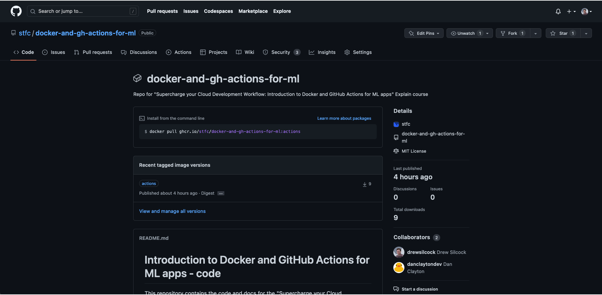

# 3. :rocket: CI/CD with GitHub Actions

We've wrapped up our model and containerised it with Docker. The next step is to create some CI/CD pipeline with GitHub Actions to do some automatic linting and testing of our code, and then building and deploying our Docker image to the GitHub Container Registry.

## Recap - CI/CD

### What's continuous integration all about?

In short, continuous integration (or CI) just means setting up a computer to run automatic checks over your code every time you upload a commit to your repository.

This is a super simple idea but can bring a lot of power and versatility to your project workflow. Not only will CI check common mistakes and typos for you, it can provide a history of builds and documentation so that you can track down any bugs you find to the exact commit that caused them (also known as regression).

### Why continuously deploy?

There's a bunch of major advantages to continuous deploying your software:

1. You don't need to worry about having a dev environment set up the right way with the right software and library versions because it's entirely pre-specified by the CD pipeline.
2. It encourages you to do lots of small updates to your app, instead of leaving your deployment for months and having every deploy be a major task. This encourages rapid iteration and makes rolling back a breeze.
3. You can extend your pipeline to automate more advanced workflows, like deploying a whole new version of your cloud environment for a release candidate, or for new features.
4. It's repeatable and less error-prone - by taking away the human element in the deployment process, you ensure that every deployment runs exactly the same. There's no possibility of accidentally deploying to the wrong instance or running commands in the wrong order or any of that. If your deployment works the 1st time, it should be the 1000th time.
5. You can get on with other things. You don't need to manually run anything to have your code deployed. You can push up your code knowing in full confidence that the CD pipeline will safely deploy it for you. That means that instead of running any commands manually or monitoring deploy commands, you can get on with some more interesting things!

## Let's create our first GitHub Action workflow

Our first GitHub Action workflow is going to be a simple "lint" workflow.

GitHub Actions workflows all live in the `.github/workflows` folder. Each workflow has it's own YAML file. Let's create our lint workflow YAML file:

!!! example "`.github/workflows/lint.yml`"
    ```yaml linenums="1"
    name: Lint

    on:
      push:
      pull_request:
        types: [opened, reopened]
    
    jobs:
      lint:
        runs-on: ubuntu-latest
        steps:
    ```

This contains all of the boilerplate of the workflow without any of the actual steps. The `name` is a simple human-readable string that indicates to us what this pipeline is doing.

By specifying `push` and `pull_request` under the `on` section, we're saying that this workflow should run whenever anyone pushes code to the repository and also when pull requests are opened or reopened. This is a fairly standard trigger setup for linting / testing workflows.

Now that we've got the boilerplate, let's add some actual steps. First, we're going to checkout the code into the Action runner:

!!! example "`.github/workflows/lint.yml`"
    ```yaml linenums="1" hl_lines="12"
    name: Lint

    on:
      push:
      pull_request:
        types: [opened, reopened]
    
    jobs:
      lint:
        runs-on: ubuntu-latest
        steps:
          - uses: actions/checkout@v3
    ```

The `uses` here indicates that we're using a pre-built step from another repository. As we specify `actions/checkout` as the repository, we know that we are using the pre-built Action step specified in https://github.com/actions/checkout. The `@v3` means that we are using git tag `v3` of the action.

As you might expect, this is an official pre-built Action from GitHub. There are loads of different pre-built Actions you can use, though - some of them official and some of them unofficial.

There's even a marketplace where you can see all the different Actions you can take advantage of - take a look: https://github.com/marketplace?type=actions.

Next, let's set up Poetry and Python:

!!! example "`.github/workflows/lint.yml`"
    ```yaml linenums="1" hl_lines="14-22"
    name: Lint

    on:
      push:
      pull_request:
        types: [opened, reopened]
    
    jobs:
      lint:
        runs-on: ubuntu-latest
        steps:
          - uses: actions/checkout@v3
    
          - name: Install Poetry
            run: pipx install poetry
    
          - name: Set up Python
            id: setup-python
            uses: actions/setup-python@v4
            with:
              python-version: '3.10'
              cache: poetry
    ```

The GitHub-hosted runners come with a load of packages pre-installed, so we don't need to worry about installing `pipx` - it's already there! We do want to have a special action for setting up Python, though, because:

- It makes sure we are using the correct version of Python, i.e. 3.10 instead of 3.8 or 3.11.
- It sets up the caching of dependencies for us to speed up subsequent builds.

Now that we have Poetry and Python set up, we can install our dependencies:

!!! example "`.github/workflows/lint.yml`"
    ```yaml linenums="1" hl_lines="24-26"
    name: Lint

    on:
      push:
      pull_request:
        types: [opened, reopened]
    
    jobs:
      lint:
        runs-on: ubuntu-latest
        steps:
          - uses: actions/checkout@v3
    
          - name: Install Poetry
            run: pipx install poetry
    
          - name: Set up Python
            id: setup-python
            uses: actions/setup-python@v4
            with:
              python-version: '3.10'
              cache: poetry
    
          - name: Install project
            run: poetry install --no-interaction
    ```

It's as simple as that! Finally, we can add our command to lint our code. We've already added a task for this to the `pyproject.toml` configuration using [Taskipy](https://github.com/illBeRoy/taskipy), so we can go ahead and run that now:

!!! example "`.github/workflows/lint.yml`"
    ```yaml linenums="1" hl_lines="27-28"
    name: Lint

    on:
      push:
      pull_request:
        types: [opened, reopened]
    
    jobs:
      lint:
        runs-on: ubuntu-latest
        steps:
          - uses: actions/checkout@v3
    
          - name: Install Poetry
            run: pipx install poetry
    
          - name: Set up Python
            id: setup-python
            uses: actions/setup-python@v4
            with:
              python-version: '3.10'
              cache: poetry
    
          - name: Install project
            run: poetry install --no-interaction
    
          - name: Lint
            run: poetry run task lint
    ```

That's all there is to it!

Go ahead and commit this and push it up, and take a look at the "Actions" tab in your GitHub repository. You should be able to see some happy Actions running and linting your code.

## Let's get testing

Now that we have a linting workflow, we're going to add another workflow for testing our code. We've already got our pytest test set up and ready to go, we just need to create our workflow YAML file. We can use 90% of the same code as the linting workflow with a couple of minor tweaks:

!!! example "`.github/workflows/test.yaml`"
    ```yaml linenums="1" hl_lines="1 27-28"
    name: Test

    on:
      push:
      pull_request:
        types: [opened, reopened]

    jobs:
      test:
        runs-on: ubuntu-latest
        steps:
          - uses: actions/checkout@v3
    
          - name: Install Poetry
            run: pipx install poetry

          - name: Set up Python
            id: setup-python
            uses: actions/setup-python@v4
            with:
              python-version: '3.10'
              cache: poetry

          - name: Install project
            run: poetry install --no-interaction

          - name: Test
            run: poetry run task test
    ```

You can see here that there are only 3 lines different from the linting workflow - all the setup is the same.

Commit this and push it up, and you should see our new "Test" workflow running alongside the "Lint" workflow.

## It's time to push

Our final GitHub Actions workflow is going to build the Docker image for our FastAPI application and push it up to the GitHub Container Registry. This will link the pushed image with our repository so that it appears under the "Packages" section, beneath "Releases". We're going to make it publicly available so that our Azure App Service can easily find it later in the next section.

!!! example "`.github/workflows/deploy.yml`"
    ```yaml linenums="1"
    name: Deploy

    on: [push]

    env:
      REGISTRY: ghcr.io
      IMAGE_NAME: ${{ github.repository }}

    jobs: 
      deploy:
        runs-on: ubuntu-latest
        steps:
          - name: Checkout repository
            uses: actions/checkout@v3
    ```

This is going to start out fairly similar to the lint and test workflows. There are a couple of differences, however:

- We're only running on push, not pull request. That's because we don't want pull requests to trigger a deployment.
- We've got a couple of environment variables set, namely `REGISTRY and `IMAGE_NAME`. We're going to be using these later when we're tagging and deploying our image.

The first real step of the Docker build and push process is to log into the GitHub container registry. To do this, we're using a built-in called `secrets.GITHUB_TOKEN`:

!!! example "`.github/workflows/deploy.yml`"
    ```yaml linenums="1" hl_lines="16-21"
    name: Deploy

    on: [push]

    env:
      REGISTRY: ghcr.io
      IMAGE_NAME: ${{ github.repository }}

    jobs: 
      deploy:
        runs-on: ubuntu-latest
        steps:
          - name: Checkout repository
            uses: actions/checkout@v3

          - name: Log in to the Container registry
            uses: docker/login-action@f4ef78c080cd8ba55a85445d5b36e214a81df20a
            with:
              registry: ${{ env.REGISTRY }}
              username: ${{ github.actor }}
              password: ${{ secrets.GITHUB_TOKEN }}
    ```

Next, we're going to use another pre-built action to generate all the right metadata for our Docker image. This does things like set the correct tag based on the tag and/or branch, set labels to indicate who created the image, what version it is, what the GitHub repository URL is, etc. This also links the image with the repository within the GitHub user interface so that the image is shown on the page for the repository.

!!! example "`.github/workflows/deploy.yml`"
    ```yaml linenums="1" hl_lines="23-30"
    name: Deploy

    on: [push]

    env:
      REGISTRY: ghcr.io
      IMAGE_NAME: ${{ github.repository }}

    jobs: 
      deploy:
        runs-on: ubuntu-latest
        steps:
          - name: Checkout repository
            uses: actions/checkout@v3

          - name: Log in to the Container registry
            uses: docker/login-action@f4ef78c080cd8ba55a85445d5b36e214a81df20a
            with:
              registry: ${{ env.REGISTRY }}
              username: ${{ github.actor }}
              password: ${{ secrets.GITHUB_TOKEN }}

          - name: Extract metadata (tags, labels) for Docker
            id: meta
            uses: docker/metadata-action@v4.3.0
            with:
              images: ${{ env.REGISTRY }}/${{ env.IMAGE_NAME }}
              tags: |
                # set latest tag for default branch
                type=raw,value=latest,enable={{is_default_branch}}
    ```

With our metadata generated, we can add another step to actually build and push the Docker image. We can use another pre-built Action for this as well:

!!! example "`.github/workflows/deploy.yml`"
    ```yaml linenums="1" hl_lines="32-38"
    name: Deploy

    on: [push]

    env:
      REGISTRY: ghcr.io
      IMAGE_NAME: ${{ github.repository }}

    jobs: 
      deploy:
        runs-on: ubuntu-latest
        steps:
          - name: Checkout repository
            uses: actions/checkout@v3

          - name: Log in to the Container registry
            uses: docker/login-action@f4ef78c080cd8ba55a85445d5b36e214a81df20a
            with:
              registry: ${{ env.REGISTRY }}
              username: ${{ github.actor }}
              password: ${{ secrets.GITHUB_TOKEN }}

          - name: Extract metadata (tags, labels) for Docker
            id: meta
            uses: docker/metadata-action@v4.3.0
            with:
              images: ${{ env.REGISTRY }}/${{ env.IMAGE_NAME }}
              tags: |
                # set latest tag for default branch
                type=raw,value=latest,enable={{is_default_branch}}

          - name: Build and push Docker image
            uses: docker/build-push-action@ad44023a93711e3deb337508980b4b5e9bcdc5dc
            with:
              context: .
              push: true
              tags: ${{ steps.meta.outputs.tags }}
              labels: ${{ steps.meta.outputs.labels }}
    ```

That's it! Commit that and push it up, and you should see your image pushed up to your container registry.

Take a look at your repository now. You should see something new under the "Packages" section, underneath "Releases":


**There it is!**
{: style="font-size: small; margin-top: -25px; width: 100%; text-align: center;"}



**You can see details about the tags, contributors, etc. all here.**
{: style="font-size: small; margin-top: -25px; width: 100%; text-align: center;"}

!!! success "Your image has been continuously delivered!"
    Good job, you've successfully created your CI/CD pipeline with GitHub Actions.

    You can now start harnessing the power of GitHub's runners to do the heavy lifting for you, freeing you up to focus on doing more code and research.
