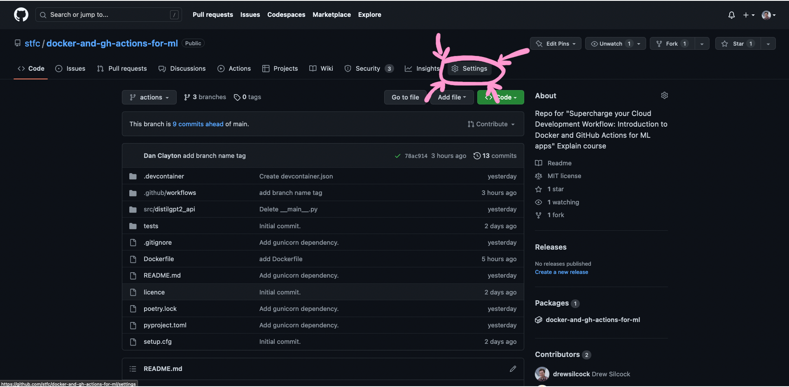
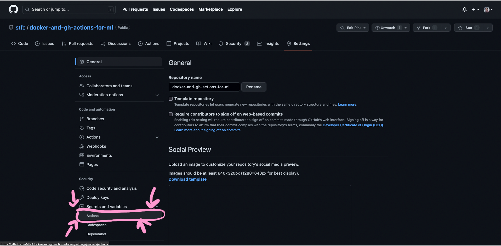
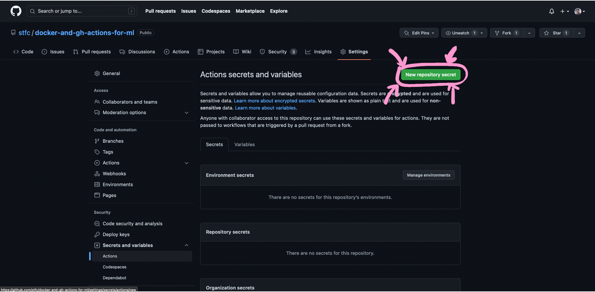
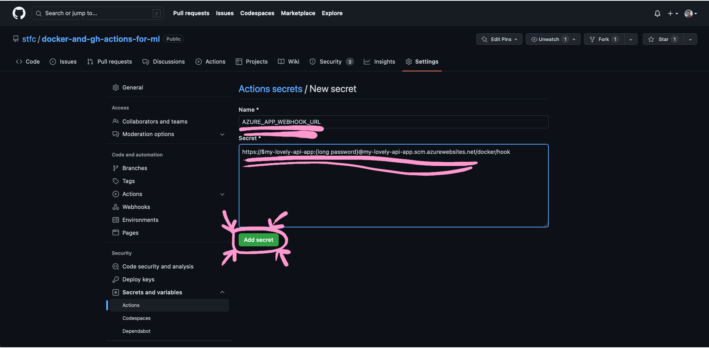
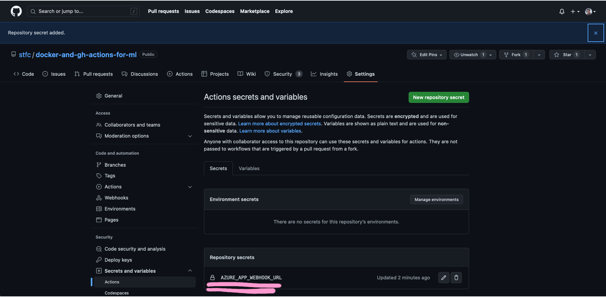

# 4. :cloud: Deploying to Azure

Now that we've got a working continuous deployment pipeline taking changes to our code and pushing Docker images up into the GitHub Container Registry, we can deploy our application to the cloud as a cloud-native web service.

To do this, we're going to use [Microsoft's Azure](https://azure.microsoft.com/en-gb){target="_blank" rel="noopener noreferrer"} cloud computing service - in particular, a service called [Azure App Service](https://azure.microsoft.com/en-us/products/app-service/){target="_blank" rel="noopener noreferrer"}.

## Recap - cloud and Azure

Before we dig into Azure App Service, let's have a quick recap on what we discussed earlier about the cloud in general and Azure specifically.

"Cloud" is a phrase that gets thrown around a lot, but what does it [actually mean](https://xkcd.com/908/)?

Some people like to say that "the cloud is other people's computers" - and this is kind of true. It's a massive network of computers linked together by complex software-based networking and redundancy, but it's still other people's computers.

These computers are physical things you can go visit. If you can get past Microsoft's security team, that is. (Which you probably can't.) I'd recommend visiting virtually, instead - you can do a [full virtual tour of an Azure data centre](https://news.microsoft.com/stories/microsoft-datacenter-tour/) - it's pretty neat!

{: style="width: 100%"}

**Microsoft's Des Moines data centre, a.k.a. "US Central"️<br>© Google Maps**
{: style="font-size: small; margin-top: -25px; width: 100%; text-align: center;"}

### Economies of scale

The main advantage of the cloud is economy of scale. If I wanted to start a business that does machine learning, I'd need to buy a bunch of expensive GPUs (i.e.a big capital investment) before I could start to do any good research which I could then sell on. With the cloud, I can just tap into some of Microsoft's existing GPUs and pay an hourly rate for just the time I need.

Because Microsoft have thousands of servers and GPUs, they're able to manage them much more cost and time efficiently, and thus pass on those scaling efficiencies to end users.

### Managed services and SEP theory

One of the main advantages of using cloud service providers like Microsoft's Azure is that you can utilise what are referred to as managed services. This means that Microsoft take care of all of the effort of maintaining a particular application like a database or web server or whatever, and give you a nice self-service interface to be able to use this service.

For instance, if you want to host your own PostgreSQL database, you could spin up a fresh VM and install PostgreSQL on it - sounds simple, right? Managing a production database at scale with high available is immensely difficult. With Azure's "Azure Databases for PostgreSQL" managed service, Microsoft handle all the management, maintenance, replication, failover, etc. and give you a button that says "New database", saving you many, many days of installing, debugging, monitoring and so on. You still need to do some monitoring and management, obviously, but nothing like you need to do if you're rolling your own database.

This is referred to[^1] as SEP theory - by using managed services, you're making more things Somebody Else's Problem.

We will be using the managed service called "Azure App Service" which we're using essentially as "running a Docker container as a service". (App Service also supports uploading your code only and selecting a runtime.)

[^1]: By me

### Azure terminology

**Tenant:** This identifies the Azure "directory" that you are in. A single account can log into multiple directories and each directory is entirely separately from each other. Typically, your company will have one (or more) directories dedicated to it. The tenant is the highest level container within Azure - everything in Azure from accounts to subscriptions to resource groups to individual resources are all contained within a tenant.

**Subscription:** A tenant has one or more subscriptions within in. Each subscription is essentially a "costing centre" - it's how Azure ties your payment details (e.g. your credit card) into Azure. Costing is done at the subscription level and all resource groups and individual resources live within a subscription. It's essentially the layer below the tenant.

**Resource group:** Individual resources like databases and apps cannot live freely but live within a particular resource group. A resource group is a way of grouping together different resources that relate to a particular product or feature. For instance, you might want to have a "web portal" resource group that contains the API, frontend and database for your web portal, while another resource group called "data pipeline" contains all the resources for your data processing pipeline.

**Resource:** A resource is the individual instance of a service that you are using in Azure. An app in Azure App Service is a resource. An instance of Azure SQL is a resource, and so on.

### Getting set up with the Azure CLI

We're going to be using the Azure CLI to create our app. You can use the portal too, but we're using the CLI.

First things first, make sure the Azure CLI is installed - if you're using the GitHub codespace, this should come pre-installed. You can check this with:

```bash
az --version
```

If it's not installed, follow the instructions here to install it: https://learn.microsoft.com/en-us/cli/azure/install-azure-cli-linux?pivots=apt#installation-options

You should've received or have access to a tenant, subscription, username and password to login to Azure. Let's use that to login to the Azure CLI:

```bash
tenant_id="our tenant ID"
subscription_id="our subscription ID"
sp_app_id="your username"
sp_password="your password"

az login --service-principal --tenant "$tenant_id" -u "$sp_app_id" -p "$sp_password"
```

To verify that you're successfully logged in, run:

```bash
az account show
```

To make sure you're in the right subscription, you can run:

```bash
az account set --subscription "$subscription_id"
```

!!! info "What's a Service Principal (SP)?"
    Azure has normal users associated with emails, and it also has accounts designed to be used by machines like CI pipelines. These are called "Service Principals" or SPs for short.
    
    We're using one of these accounts for the purpose of this Explain course. This is basically just for convenience - if you're managing your Azure resources in real life, you'll be logged in with your email address instead of a service principal. Everything else is the same between them apart from your can't log into the Azure Portal in your browser using a service principal. We can still use the Azure CLI, though!

### Creating a GitHub Personal Access Token (PAT)

Before we link the Azure Web App we're going to create to our image in the GitHub Container Registry, we need to create a Personal Access Token (PAT) in GitHub to allow Azure to access our image manifest.

Don't worry, this isn't as complicated as it sounds. Here's how to do it:

TODO: Screenshot of hover over "Settings" button

**Step 1: click on "Settings" button from dropdown after clicking on GitHub profile icon in top right.**
{: style="font-size: small; margin-top: -25px; width: 100%; text-align: center;"}

TODO: Screenshot of hover over "Developer Settings" button

**Step 2: click on "Developer Settings" button at the bottom of the menu on the left of the page.**
{: style="font-size: small; margin-top: -25px; width: 100%; text-align: center;"}

TODO: Screenshot of hover over "Tokens (classic)" under "Personal access tokens"

**Step 3: Click on "Personal access tokens" and then on "Tokens (classic)".**
{: style="font-size: small; margin-top: -25px; width: 100%; text-align: center;"}

TODO: Screenshot of hover over "Generate new token (classic)" under "Generate new token".

**Step 4: Under "Note", put a name to help you recognise what this PAT is for. Something like "Supercharge Azure App" would be good.**
{: style="font-size: small; margin-top: -25px; width: 100%; text-align: center;"}

TODO: Screenshot of selecting "write:packages" under "Select scopes"

**Step 5: **
{: style="font-size: small; margin-top: -25px; width: 100%; text-align: center;"}

TODO: Screenshot of hover over "Generate token" button

**Step 6: **
{: style="font-size: small; margin-top: -25px; width: 100%; text-align: center;"}

TODO: Screenshot of page showing PAT token value.

**Step 7: **
{: style="font-size: small; margin-top: -25px; width: 100%; text-align: center;"}

### Creating the Azure App Service app

Now that we're logged into Azure, let's create our app.

We are putting our app into a resource group that we've created especially called `hncdi-explain-supercharge`. It has to be in this resource group because the service principal we're using has its permissions restricted to that resource group.

Before we can create our app, we need to create a service plan for this app to be associated with. A service plan is how Azure decides what resources to allocate to your app. You can scale up your service plan after you've created it, so you can dynamically scale your resource based on your requirements.

This is great because it means that you can start off on a cheap (or even free) plan, then only scale up to more expensive plans when you need to!

Let's create our app service plan in the ["B2" tier](https://azure.microsoft.com/en-gb/pricing/details/app-service/linux/) using Linux, which means that we get 2 vCPUs, 3.5 GB of RAM and 10 GB of storage. That should be plenty for our purposes.

```bash
my_app_name="put something unique to you in here, like your name or random string"

az appservice plan create --name "$my_app_name-plan" --resource-group "$resource_group" --sku B2 --is-linux
```

Now we're ready to create our actual app:

```bash
my_github_username="put your GitHub username here"

az webapp create --name "$my_app_name-app" \
    --resource-group "$resource_group" \
    --plan "$my_app_name-plan" \
    --deployment-container-image-name "ghcr.io/$my_github_username/distilgpt2-api:latest"
```

This might take a couple of while to complete. This is because our Docker image is about 1.5 GB, mostly of which is pytorch runtime dependency files. Be patient with it and if you think it's actually stuck, just let us know and we can debug it together over Zoom. With our permissions we can see all the logging from the app which we can use to figure out what's going on.

Once it finishes, you should be able to access your API using the URL https://$my_app_name-app.azurewebsites.net where you replace `$my_app_name` with the name you decided to use for your application.

!!! warning "Common pain-points"
    There's a couple of common pain points around this which are difficult to debug.

    - *Forgetting to put `EXPOSE 8000` in the `Dockerfile`*. Without this command, Azure App Service doesn't know which port your application is running on, so it will default to 80. It'll keep waiting for your application to be healthy on port 80 which will obviously never happen because we're not using that port.
    - *I've updated my Docker image / App Service configuration but it hasn't changed anything!* Azure App Service is a complex system, and it can sometimes take a few minutes for changes to propagate. One tip is to stop the app, wait a few seconds and then start it again, then try to visit the web page in your browser again - this restart the app, causing it to check for new images and configurations, etc.

Try visiting https://$my_app_name-app.azurewebsites.net/Here's%20a%20story%20about and see what it shows. If you can see some successfully generated text, that means you've successfully deployed your app to Azure. Good job!

## Calling to Azure App Service webhook in deploy Action

There's only one thing left to do, and that is update our GitHub Action to tell our Azure App Service app that we have deployed a new image and that they should go get it.

This is pretty simple - App Service provides a URL that you can send a POST request to that'll do exactly this. All we have to do is retrieve this special URL and put it into the GitHub Action.

```bash
az webapp deployment container show-cd-url -g hncdi-explain-supercharge -n $my_app_name-app
```

This should show a little JSON object with a key called `CI_CD_URL` - this is the URL we need. Go ahead and copy that value. It should look something like `https://$my-lovely-api-app:{long password}@my-lovely-api-app.scm.azurewebsites.net/docker/hook`.

Let's update our GitHub Action workflow to add this in:

!!! example "`.github/workflows/`"
    ```yaml linenums="1"
    name: Deploy

    on: [push]

    env:
      REGISTRY: ghcr.io
      IMAGE_NAME: ${{ github.repository }}

    jobs: 
      deploy:
        runs-on: ubuntu-latest
        steps:
          - name: Checkout repository
            uses: actions/checkout@v3

          - name: Log in to the Container registry
            uses: docker/login-action@f4ef78c080cd8ba55a85445d5b36e214a81df20a
            with:
              registry: ${{ env.REGISTRY }}
              username: ${{ github.actor }}
              password: ${{ secrets.GITHUB_TOKEN }}

          - name: Extract metadata (tags, labels) for Docker
            id: meta
            uses: docker/metadata-action@v4.3.0
            with:
              images: ${{ env.REGISTRY }}/${{ env.IMAGE_NAME }}
              tags: |
                # set latest tag for default branch
                type=raw,value=latest,enable={{is_default_branch}}
                type=ref,event=branch

          - name: Build and push Docker image
            uses: docker/build-push-action@ad44023a93711e3deb337508980b4b5e9bcdc5dc
            with:
              context: .
              push: true
              tags: ${{ steps.meta.outputs.tags }}
              labels: ${{ steps.meta.outputs.labels }}

        - name: Call Azure App Service webhook
          run: curl -X POST "$AZURE_APP_WEBHOOK_URL"
    ```

!!! warning "We don't want to commit our actual URL into the repository"
    This URL is supposed to be a secret, hence why it has a username and password embedded into it. We don't want to commit this secret to our repository - anyone could start hitting our webhook endpoint!

    Instead, we're going to put it in an variable in the repository settings.

To add this secret to our GitHub repository for the Actions to see, we need to:



**Step 1: Go to our repository page on GitHub and click on "Settings".**
{: style="font-size: small; margin-top: -25px; width: 100%; text-align: center;"}



**Step 2: Click on "Secrets and variables" and then "Actions".**
{: style="font-size: small; margin-top: -25px; width: 100%; text-align: center;"}



**Step 3: Click on "New repository secret".**
{: style="font-size: small; margin-top: -25px; width: 100%; text-align: center;"}



**Step 4: Put `AZURE_APP_WEBHOOK_URL` under "Name" and the full URL of your webhook from the Azure CLI command under "Secret", then click on "Add secret".**
{: style="font-size: small; margin-top: -25px; width: 100%; text-align: center;"}



**You should now see your secret appear under the "Repository secrets" section of this page.**
{: style="font-size: small; margin-top: -25px; width: 100%; text-align: center;"}

## Trying out the continuous deployment

Now that we've got it all up and working, let's test it out!

To try it out, let's make a minor change to our root endpoint. This will add the current application version to the health endpoint result:

!!! example "`src/distilgpt2_api/api.py`"
    ```python linenums="1" hl_lines="3 25"
    import logging
    from functools import cache
    from importlib.metadata import version

    from fastapi import FastAPI, Depends

    from .text_generation import TextGenerator

    app = FastAPI()


    @cache
    def get_model() -> TextGenerator:
        logging.error("Loading DistilGPT2 model")
        return TextGenerator()


    @app.on_event("startup")
    async def on_startup():
        get_model()


    @app.get("/")
    async def health():
        return {"health": "ok", "version": version(__name__.split(".", maxsplit=1)[0])}


    @app.get("/{prompt}")
    async def generate_text(
        prompt: str,
        max_new_tokens: int = 50,
        num_return_sequences: int = 1,
        model: TextGenerator = Depends(get_model),
    ) -> dict:
        sequences = model.generate(
            prompt, max_new_tokens=max_new_tokens, num_return_sequences=num_return_sequences
        )
        return {"generated_sequences": sequences}
    ```

The `__name__.split(".", maxsplit=1)[0]` just gets us the name of the Python package we're in, and `version()` gives us the corresponding package version.

Commit this and push it up, then take a look at the "Actions" tab on your GitHub repository to see it running.

Once that's completed and you've waited a couple of minutes for the update to propagate into Azure, you should be able to hit your Azure App Service app endpoint and see the updated result.

!!! success "Congratulations!"
    If you've made it this far, it means you've successfully completed our Explain workshop.

    We really hope that you enjoyed this and learned a bit about FastAPI, Docker, GitHub Actions and Azure App Service.

    If you get this far, **please do let us know!** We'd love to hear it.

    *Remember to head over to the course page to give us some feedback!*
