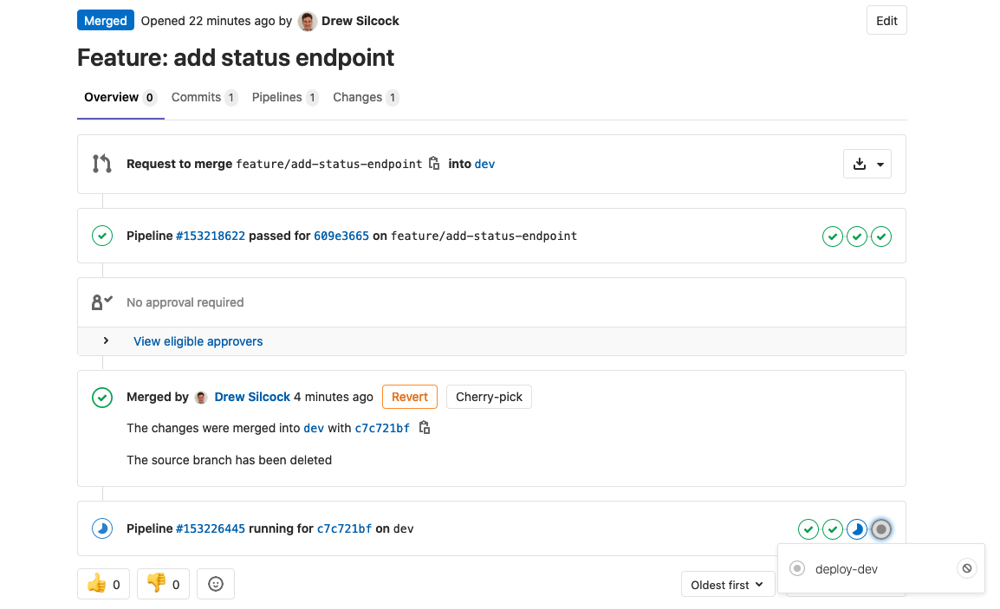

# 5. :rocket: Setting up continuous deployment

We've done some really cool things with our git flow, semantic versioning and continuous integration, but I'm sure you're wondering when we're going to actually put this API up for people to use.

Well, fear not, because this last section is going to talk you through extending our existing CI pipeline to add continuous deployment!

## Why continuously deploy?

There's a bunch of major advantages to continuous deploying your software:

1. You don't need to worry about having a dev environment set up the right way with the right software and library versions because it's entirely pre-specified by the CD pipeline.
2. It encourages you to do lots of small updates to your app, instead of leaving your deployment for months and having every deploy be a major task. This encourages rapid iteration and makes rolling back a breeze (especially with GitLab CI).
3. You can extend your pipeline to automate more advanced workflows, like deploying a whole new version of your cloud environment for a release candidate, or for new features.
4. It's repeatable and less error-prone - by taking away the human element in the deployment process, you ensure that every deployment runs exactly the same. There's no possibility of accidentally deploying to the wrong instance or running commands in the wrong order or any of that. If your deployment works the 1st time, it should be the 1000th time.

## Creating our app manifests

Different cloud providers have different techniques for deploying apps. We're going to be using IBM Cloud's CloudFoundry to deploy ours, which means that we need to add a YAML manifest file for the API.

We're going to have two separate deployments:

- one `hbaas-dev` service for testing purposes, deployed from the `dev` branch, and
- one `hbaas-prod` service as the production instance, deployed from the `master` branch.

Let's see what this looks like in code:

!!! example "`manifest.yaml`"
    ```yaml linenums="1"
    ---
    applications:
      - name: hbaas-server-dev
        instances: 1
        memory: 1GB
        routes:
          - route: myorg-hbaas-dev.eu-gb.cf.appdomain.cloud
        # You can specify any environment variables to pass through to the application
        # here. The only one we need right now is the API environment, but if we were
        # connecting to external services like databases, we would want to include the
        # environment variables for these credentials here. Just be careful what you
        # commit to the repository and who can access that! Depending on your
        # requirements, it may be more appropriate to keep secret credentials in the CI
        # runner secrets and inject them from the CI pipeline.
        env:
          HBAAS_ENV: dev

      - name: hbaas-server-prod
        # If your app requires more resources, you can increase the n# instances &
        # available memory here to match your requirements.
        instances: 1
        memory: 1GB
        routes:
          - route: myorg-hbaas-prod.eu-gb.cf.appdomain.cloud
        env:
          HBAAS_ENV: prod
    ```

!!! warning
    The route here must be globally unique, which means if everyone uses the same one, the deployment will fail. Make sure you use a unique route to avoid encountering this difficulty!

Normally, this configuration would include either a "buildpack" or the path to a Docker image to specify the actual application that's going to be run.

Instead, we're going to leave this blank in the `manifest.yaml` because we're going to be specifying the path to the Docker image dynamically. I'll explain why this is when we get there.

Let's update our `Makefile` to allow us to easily deploy our dev and prod APIs:

!!! example "`Makefile`"
    At the top of the file:

    ```Makefile linenums="3" hl_lines="4-6"
    PROJECTNAME := hbaas-server
    DOCKERREGISTRY := uk.icr.io/my-org

    # Change these as you require, based on your IBM Cloud account setup.
    CFREGION := eu-gb
    CFSPACE := my-cloud-foundry-space

    # Go related variables.
    GOBASE := $(shell pwd)
    ```

    Towards the bottom of the file:

    ```Makefile linenums="111" hl_lines="5-24"
    	    $(call log-error,Unable to deploy Docker image to repository.) \
    	    && false \
    	)

    ## deploy-dev: Build and deploy Cloud Foundry development app instance.
    deploy-dev:
    	APPTODEPLOY=$(PROJECTNAME)-dev make deploy-app

    ## deploy-prod: Build and deploy Cloud Foundry production app instance.
    deploy-prod:
    	APPTODEPLOY=$(PROJECTNAME)-prod make deploy-app

    deploy-app: upload-image
    	@$(call log,Deploying app $(APPTODEPLOY) $(VERSION) to Cloud Foundry...)
    	ibmcloud target --cf -s $(CFSPACE) -r $(CFREGION)
    	ibmcloud cr login
    	CF_DOCKER_PASSWORD=${IBMCLOUD_API_KEY} ibmcloud	push \
    	    -f manifest.yaml $(APPTODEPLOY) \
    	    --docker-image $(DOCKERREGISTRY)/$(PROJECTNAME):$(VERSION) \
    	    --docker-username iamapikey || \
    	(\
    	    $(call log-error,Unable to deploy Cloud Foundry app.) \
    	    && false \
    	)

    ## clean: Clean build files. Runs `go clean` internally.
    clean:
    	@-rm $(OUTBINDIR)/$(PROJECTNAME) 2> /dev/null
    ```

Importantly, in order to deploy our app to CloudFoundry from our private registry, we need our IBM Cloud API key from [Section 4](/4-continuous-integration) in our environment. This is because CloudFoundry needs the key to get access to your private repository to pull our application image.

We also need to specify the space and region that we're targeting for CloudFoundry - the region will likely be `eu-gb` and the space will be specified when your IBM Cloud is set up - if you're not sure what to put for the space, get in contact with us and we can sort you out.

Let's give it a whirl!

```bash
$ export IBMCLOUD_API_KEY={you value from last section}
# As before, you'll need to re-run `ibmcloud login` if you haven't run it in while.
$ make deploy-dev
```

If all is successful, you should see some output indicating that your app has been successfully deployed, like so:


!!! tip
    Notice how we're pinning the app - even the dev instance! - to a specific version of the image. This is because we don't want our app updating without our knowing because we updated the `:latest` image.

    By pinning to a specific version, that ensures that this particular app deployment is reproducible, i.e. it's always going to give you the same results. If you do use the `:latest` tag instead of a pinned version, you're app is liable to change when it's re-staged, whether you wanted it to or not.

Let's give our newly deployed app a go:

```bash
# You'll need to change this URL depending on what you put as your route in the
# `manifest.yaml`.
$ curl https://myorg-hbaas-dev.eu-gb.cf.appdomain.cloud/version
> {"build_time":"2020-06-03T10:28:28Z","version":"v1.0.0-16-g232c588"}
```

## Continuously deploying our dev instance

Now that we've got our deployment working, let's extend our GitLab CI pipeline to enable us to re-deploy our dev CloudFoundry app instance:

!!! example "`.gitlab-ci.yml`"
    ```yaml linenums="1" hl_lines="13 47-69"
    image: golang

    cache:
      key: ${CI_COMMIT_REF_SLUG}
      paths:
        - .go-bin
        - .go-pkg

    stages:
      - lint
      - build
      - docker
      - deploy

    lint:
      stage: lint
      before_script:
        - wget -O - -q https://raw.githubusercontent.com/golangci/golangci-lint/master/install.sh | sh -s -- -b /go/bin v1.27.0
        # We need to run the code-gen scripts for the linting to work.
        - make code-gen
      script:
        - golangci-lint run --enable gofmt --enable goimports

    build:
      stage: build
      script:
        - make build
      artifacts:
        paths:
          - hbaas-server
        expire_in: 30 days

    upload-image:
      stage: docker
      before_script:
        - apk add --update alpine-sdk bash
        - curl -fsSL https://clis.cloud.ibm.com/install/linux | sh
        - ibmcloud plugin install container-registry -r 'IBM Cloud'
        # Latest CF is not compatible with IBM Cloud (seemingly) because the IBM Cloud CF
        # instance doesn't have log cache installed on it.
        - ibmcloud cf install --version 6.49.0 --force
        - ibmcloud login --no-region
        - ibmcloud cr region-set uk-south
      script:
        - make upload-image

    .deploy-template: &deploy-template
      stage: deploy
      image: docker:19.03.1
      before_script:
        - apk add --update alpine-sdk bash
        - curl -fsSL https://clis.cloud.ibm.com/install/linux | sh
        - ibmcloud plugin install container-registry -r 'IBM Cloud'
        # Latest CF is not compatible with IBM Cloud (seemingly) because the IBM Cloud CF
        # instance doesn't have log cache installed on it.
        - ibmcloud cf install --version 6.49.0 --force
        - ibmcloud login --no-region
        - ibmcloud cr region-set uk-south

    deploy-dev:
      <<: *deploy-template
      environment:
        name: HBaaS Dev
        # Change this depending on your route.
        url: https://myorg-hbaas-dev.eu-gb.cf.appdomain.cloud
      script:
        - make deploy-dev
      only:
        - dev
    ```

!!! info
    We're using a YAML anchor here to implement a template for the deployment that we can use later for our prod deployment.

    If you're using a newer version of GitLab, you can use the [GitLab CI-specific template syntax](https://docs.gitlab.com/ee/ci/yaml/#extends), which is generally nicer.

Commit and push this up and you should see the extra stage added to your CI pipeline:


Examining the job output for our new "deploy-dev" should show a successful dev deployment:


## Continuously deploying our prod instance

Now that we've got our dev instance continuously deploying from our GitLab, the only thing left to do is add another job to the CD pipeline within the deploy stage to deploy our production instance whenever we tag a new release:

!!! example "`.gitlab-ci.yml`"
    ```yaml linenums="46" hl_lines="25-34"
    .deploy-template: &deploy-template
      stage: deploy
      image: docker:19.03.1
      before_script:
        - apk add --update alpine-sdk bash
        - curl -fsSL https://clis.cloud.ibm.com/install/linux | sh
        - ibmcloud plugin install container-registry -r 'IBM Cloud'
        # Latest CF is not compatible with IBM Cloud (seemingly) because the IBM Cloud CF
        # instance doesn't have log cache installed on it.
        - ibmcloud cf install --version 6.49.0 --force
        - ibmcloud login --no-region
        - ibmcloud cr region-set uk-south

    deploy-dev:
      <<: *deploy-template
      environment:
        name: HBaaS Dev
        # Change this depending on your route.
        url: https://myorg-hbaas-dev.eu-gb.cf.appdomain.cloud
      script:
        - make deploy-dev
      only:
        - dev

    deploy-prod:
      <<: *deploy-template
      environment:
        name: HBaaS Prod
        # Change this depending on your route.
        url: https://myorg-hbaas-prod.eu-gb.cf.appdomain.cloud
      script:
        - make deploy-prod
      only:
        - tags
    ```

!!! warning
    This setup will run the production deployment whenever a tag is uploaded. This means that you can only use tags for version releases.

    Sometimes you might need to use tags for other purposes as well - this is fine! You just need to modify the `only` block to do one or multiple of the following:

    - Only run when tag matches semantic version, e.g. `v1.2.3`, `v1.2.3-abc` (this is what I'd recommend[^semver-regex])
    - Only run when tag in on master branch (this has important caveats to consider[^caveats])

    For more info on how to set this up, check out: [conjunction logic for GitLab CI job condition](https://gitlab.com/gitlab-org/gitlab-foss/-/issues/27818).

[^semver-regex]:
    The way to do this would be to utilise the [official semver regex](https://semver.org/#is-there-a-suggested-regular-expression-regex-to-check-a-semver-string) like so:

    ```yaml
    only:
      refs:
        - tags
      variables:
        # If you don't use a `v` before your semver, just remove the first `v` in this regex.
        - $CI_COMMIT_TAG =~ ^v(0|[1-9]\d*)\.(0|[1-9]\d*)\.(0|[1-9]\d*)(?:-((?:0|[1-9]\d*|\d*[a-zA-Z-][0-9a-zA-Z-]*)(?:\.(?:0|[1-9]\d*|\d*[a-zA-Z-][0-9a-zA-Z-]*))*))?(?:\+([0-9a-zA-Z-]+(?:\.[0-9a-zA-Z-]+)*))?$
    ```

    I haven't tested this with GitLab CI, but it should work.

[^caveats]:
    Technically, tags and branches are both just pointers to commits. This means that running on tag and master is not reproducible because another commit on the master branch will move the commit that master points to and thus would mean that the tag && master condition no longer applies.

    This breaks a pretty important principle of CD which is that you can simply repeat a pipeline and have the exact same thing happen. This reproducibility is what makes rolling back to specific versions so easy.

    This is discussed more on the [GitLab issue for this topic](https://gitlab.com/gitlab-org/gitlab-foss/-/issues/27818).

!!! note
    Notice how we specify an "environment" for each deployment - we'll take a look at what this can do later.

Go ahead and commit and push this up - we're going to test it out in the next section.

## Triggering our deployments

Now that we've got our dev and prod API instances continuous deploying, let's try out adding a new feature so that we can do a version bump and see our CD pipeline in action!

Firsly, let's add another endoint that'll work as a health check for our API:

!!! example "`handlers/maintenance.go`"
    ```go linenums="1" hl_lines="16 29-39"
    package handlers

    import (
    	"fmt"
    	"net/http"
    	"time"

    	"github.com/labstack/echo/v4"
    	"hartree.stfc.ac.uk/hbaas-server/version"
    )

    type MaintenanceHandler struct{}

    func (h MaintenanceHandler) registerEndpoints(g *echo.Group) {
    	g.GET("version", h.showVersion)
    	g.GET("status", h.status)
    }

    func (h MaintenanceHandler) showVersion(c echo.Context) error {
    	return c.JSON(
    		http.StatusOK,
    		map[string]string{
    			"version":    version.Version,
    			"build_time": version.BuildTime,
    		},
    	)
    }

    func (h MaintenanceHandler) status(c echo.Context) error {
    	now := time.Now()
    	message := fmt.Sprintf(
    		"The time is %s and all is well.",
    		now.Format("4 minutes past the 15 hour on the Monday 2 January 2006"),
    	)
    	return c.JSON(
    		http.StatusOK,
    		NewAPIMessage(message),
    	)
    }
    ```

Great, now let's do another feature branch for this:

```bash
$ git checkout dev
$ git checkout -b feature/add-status-endpoint
$ git add handlers/maintenance.go
$ git commit -m "Add status endpoint that acts as health check."
$ git push --set-upstream origin feature/add-status-endpoint
```

Now if you go to your GitLab repository and check out the merge request you just opened, you should see a nice green tick show up indicating the MR passed the CI checks:


Now if you merge this in using the GitLab UI (or alternatively merge it in using the local command-line), you should see your dev deployment trigger:



Once that's done, we can check that it's properly deployed the dev app by hitting our new status endpoint:

```bash
# Remember to change this endpoint depending on your route in your `manifest.yaml`.
$ curl https://myorg-hbaas-dev.eu-gb.cf.appdomain.cloud/status
> {"message":"The time is 41 minutes past the 11 hour on the Wednesday 3 June 2020 and all is well."}
```

Great! Now let's do a release onto master so that our prod instance updates. If you're working on a major update, it's a good idea to create a dedicated branch for the release candidate, but as we're only adding a small new feature, we can just merge straight from dev to master.

To do this, let's create another merge request, this time from dev to master:


Once that's created, make sure the CI tests pass and then merge it in!

!!! warning
    Make sure that you've got the "Delete source branch" unticked in the merge request on GitLab! You don't want the merge to get rid of our dev branch.

### Creating releases

Once that's done, all we need to do is create our new version tag on master and push it up and that'll trigger our prod deployment. Note that as we're adding a new non-breaking feature, this would correspond to a minor version update.

There are two ways to do this. There's the good ol' fashioned command-line way and the fancy GitLab UI way.

#### The good ol' fashioned command-line way

```bash
$ git checkout master
$ git pull
$ git tag -a "v1.1.0" -m "Release v1.1.0: add status endpoint"
$ git push --tags
```

Simple and easy.

#### The fancy GitLab UI way

There's another option though - GitLab provides a nice UI for creating new tags which allows you to add "Release notes" which appear under "Releases" in the project overview in GitLab.

Go to "Repository" > "Tags" in your GitLab project and click "New Tag". Here's the equivalent as above using the fancy GitLab UI:


To see your fancy new release, go to "Project overview" > "Releases":


Now sit back and watch as your CD pipeline automatically deploys our updated API:


### Understanding GitLab environments

We saw earlier that we could specify an "environment" for each of our deployments. What this does is allow us to go into GitLab and see when each environment has been deployed, easily open the URL for the environment and to easily re-run deployments on a per-environment basis:


!!! info
    If you're using a more advanced deployment system utilising Kubernetes, GitLab will integrate these environments with your Kubernetes instance.

    For more info on this, check out [the GitLab docs on Kubernetes integration](https://docs.gitlab.com/ee/user/project/clusters/index.html).

## Let's give it a whirl!

Once that's done, let's try it out!

```bash
# Remember to change this endpoint depending on your route in your `manifest.yaml`.
$ curl https://myorg-hbaas-prod.eu-gb.cf.appdomain.cloud/version
> {"build_time":"2020-06-03T10:40:59Z","version":"v1.1.0"}

$ curl https://myorg-hbaas-prod.eu-gb.cf.appdomain.cloud/status
> {"message":"The time is 59 minutes past the 11 hour on the Wednesday 3 June 2020 and all is well."}

# Just for fun - output will depend on when you run it!
$ curl https://myorg-hbaas-prod.eu-gb.cf.appdomain.cloud/date/$(date +"%d-%B")
> {"message":"Happy birthday to Clint Eastwood!"}
```

!!! success
    Congratulations, you've successfully set up a full continuous deployment pipeline!
    
    With this done, you can sit back and watch as GitLab CI takes care of all the hard-work when it comes to running and managing multiple deployments. All you need to do is code using this sensible git flow model and the rest will take care of itself!
